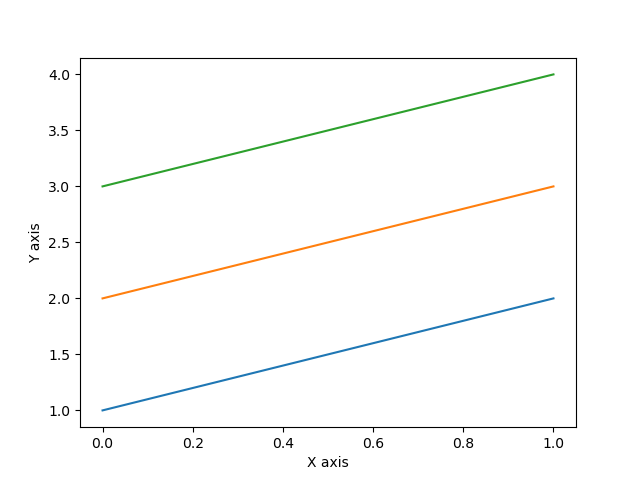
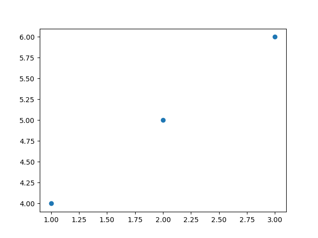

# Matplotlib

``` python
import matplotlib.pyplot as plt
```

# 线型图

```python
#绘图数据
data = np.array([[1,2,3],[2,3,4]])

#初始化
plt.plot(data)
#x,y轴
plt.xlabel("X axis")
plt.ylabel("Y axis")

plt.show()
```



# 散点图（scatter）

```python
#数据
data1 = np.array([1,2,3])
data2 = np.array([4,5,6])

#初始化
plt.scatter(data1,data2)
#三组：（1，4） （2，5），（3，6）坐标

plt.show()
```



