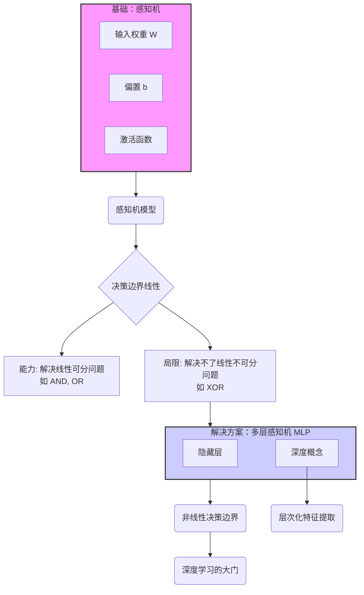

# 感知机 perceptron
## 🚀 核心速览
> 我们从最简单的神经元模型“感知机”出发，理解了它作为线性分类器的能力与局限，并最终通过引入“多层”结构，揭开了“深度学习”的序幕——其本质是通过层次化的方式解决简单模型无法处理的复杂（非线性）问题。

## 🗺️ 知识脉络图

## 🔑 关键概念解析

*   **感知机 (Perceptron)**
    *   **是什么**：最基础的神经网络单元，一个简单的二元线性分类器。
    *   **工作方式**：将所有输入特征进行加权求和，加上一个偏置，然后通过激活函数（阶跃函数）判断输出类别（通常是0或1）。

*   **偏置 (Bias)**
    *   **是什么**：一个独立于所有输入的可学习参数。
    *   **核心作用**：在几何上，它允许决策边界在特征空间中自由平移，而不仅仅是穿过原点。这极大地增强了模型的灵活性和拟合能力。

*   **线性不可分 (Linearly Inseparable)**
    *   **是什么**：指无法用一条直线（或在高维空间中的一个超平面）将不同类别的数据点完全分开的情况。
    *   **典型例子**：XOR（异或）问题。单层感知机无法解决此类问题，这是其根本局限。

*   **多层感知机 (MLP) 与 “深度”**
    *   **是什么**：通过堆叠多个感知机层（至少一个隐藏层）形成的更强大的网络结构。
    *   **“深度”的含义**：指的就是网络中隐藏层的数量。拥有多个隐藏层的网络就是“深度神经网络”（DNN）。
    *   **如何解决问题**：通过增加层数，网络可以学习到更复杂的、非线性的决策边界。每一层都可以看作是在前一层提取的特征基础上，进行更高级、更抽象的特征提取。

## 💡 核心启发

1.  **没有免费的午餐**：模型的结构决定了它的能力上限。线性模型（如单层感知机）有其固有的局限性。
2.  **抽象是有力量的**：深度学习的核心思想在于“层次化特征提取”。就像我们看物体先看到轮廓，再看到细节一样，深度网络逐层地从简单特征组合出复杂特征。
3.  **从手动到自动**：我们目前还是手动设置参数，而深度学习的真正威力在于它能利用**梯度下降**和**反向传播**等算法，从数据中自动学习出成千上万个参数，这是我们下一步要探索的核心。
